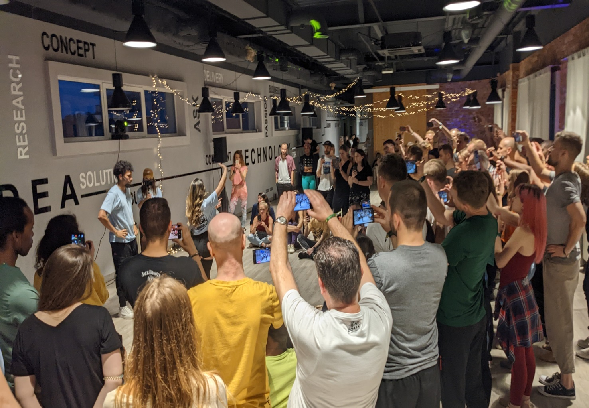
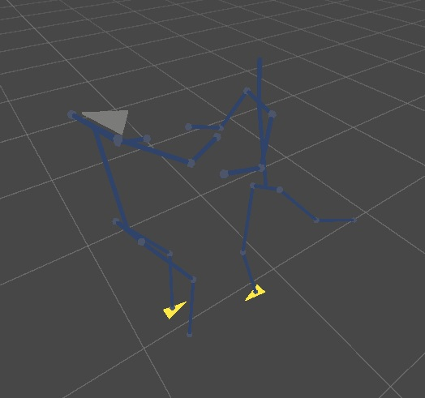
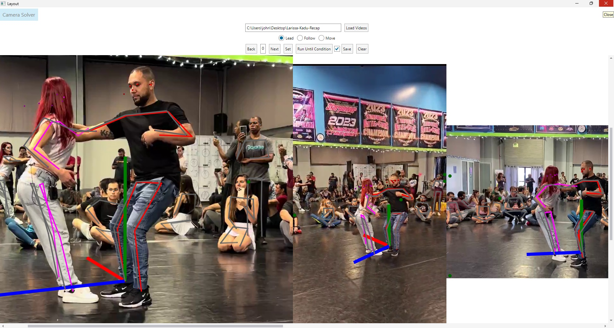

# dancer-pose-alignment

Input videos of two dancers from multiple angles, and YoloV8 tracked poses and project them into space to make a 3D model:  
  

3D output pose jsons are viewable in this Unity project. Also in VR:  
https://github.com/atonalfreerider/head-movement  
  

YoloV8:  
[https://github.com/MVIG-SJTU/AlphaPose](https://docs.ultralytics.com/tasks/pose/)
- download a model ie YOLOv8x-pose.pt, convert to onnx, and place in the assembly folder to run here. Or run yolo-pose-save.py to output poses.

The CLI also allows for affine transforms to stabilize the video sources.  

# GUI  

Run the GUI and input the root folder containing the videos. The pose of the leader is indicated by selecting the `Lead` radio button, the
pose of the follow is indicated by clicking the `Follow` pose button. The poses can be cleared.

`Run Until Condition` will fast forward the poses and video until the frame number that is input.
The user must manually set the pose assignments. There is a Kalman filter that tries to predict the next position.  

Save the poses.
